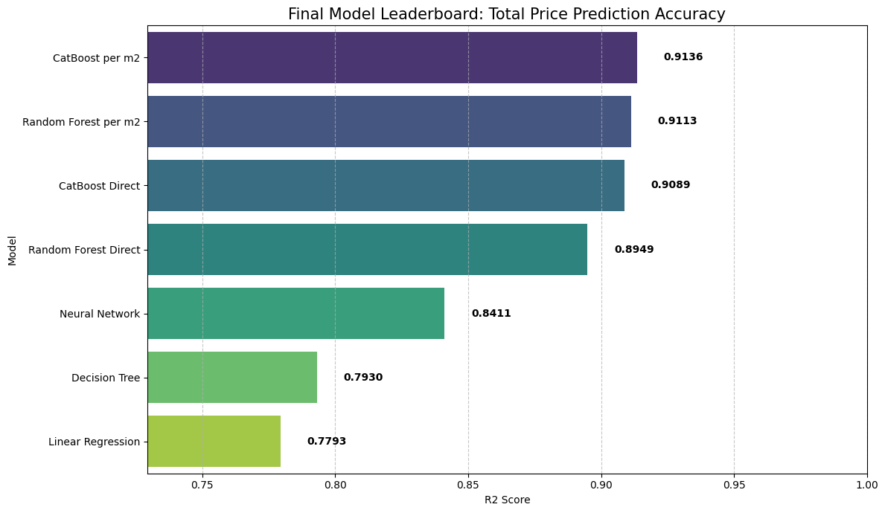
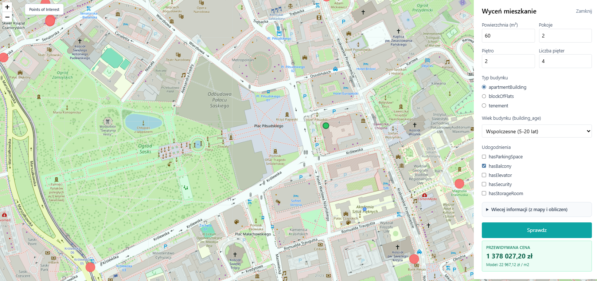
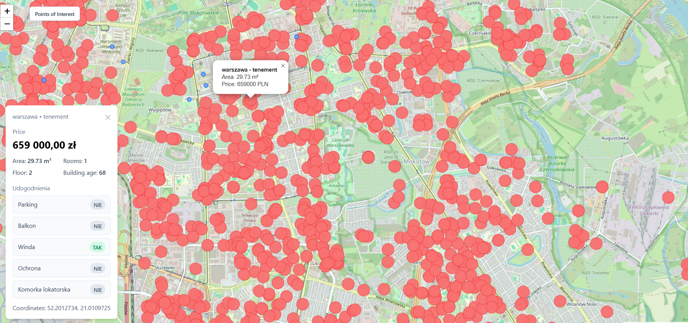
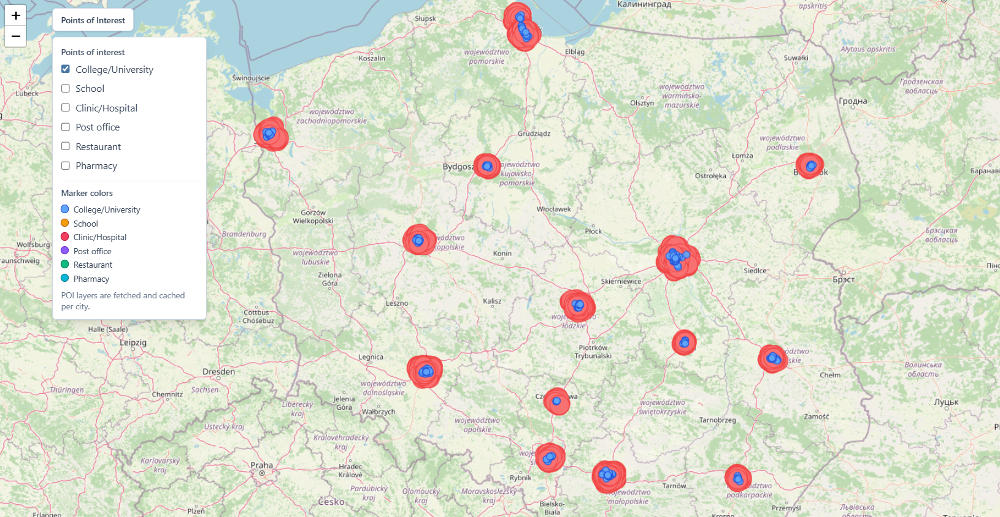
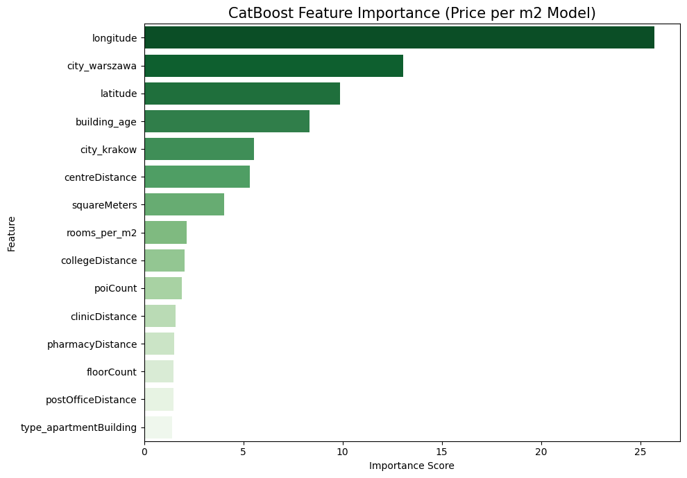

# Apartment Price Predictor (Poland)

## Project Overview

This project is a machine learning system that predicts apartment prices in Poland.

At the model level, prediction is made as **price per square meter**. The final apartment price is then derived from:

`final_price = predicted_price_per_m2 * apartment_area_m2`

The application is delivered as a full-stack solution:

- **Backend**: FastAPI service hosting the trained CatBoost model and geospatial data logic
- **Frontend**: React + Vite map-based interface for interactive pricing

## Model Development

Model development was performed in Google Colab. The repository includes a Colab notebook that documents the full experimentation workflow:

- feature analysis
- data preprocessing
- model experimentation
- model selection process

After comparing multiple candidates, the selected model was **CatBoost**, with approximately **91.3%  R2 score**.

The modeling approach focuses on predicting **price per square meter**, which provides more stable behavior than predicting total price directly. The final apartment price is then computed from the predicted unit price and apartment area.

Detailed experimentation and data handling steps are documented in the Colab notebook.

## Dataset

Training was based on the Kaggle dataset **"Apartment Prices in Poland"**.

- Dataset link: [Dataset link here]('https://www.kaggle.com/datasets/krzysztofjamroz/apartment-prices-in-poland/data/code)

## Backend Architecture

The backend is responsible for model serving and geospatial feature support.

At a high level, it:

1. hosts the trained CatBoost model
2. receives prediction requests from the frontend
3. processes apartment and location parameters
4. returns predicted pricing values

The backend also manages points-of-interest (POI) geospatial data (for example pharmacies, hospitals, post offices, restaurants, and similar amenities).

POI data is retrieved from the **Overpass API** (OpenStreetMap data), cached on the backend, and refreshed over time through cache lifecycle and refresh flows.

Additional operational details are available on the frontend **`/info`** page.

## Frontend Interface

The frontend provides a map-based pricing workflow.

Users can:

1. click a location on the map
2. enter apartment parameters (for example number of rooms, area in square meters, and other available attributes)
3. submit the request for prediction

The frontend sends request payloads to the backend and displays the predicted apartment price returned by the model service.

Predictions are based on the trained model and training dataset scope, and are limited to cities supported by the dataset.

In addition to map-click prediction, users can also click apartment points from the dataset (red markers) to inspect source records used in the project context, including building-related attributes and listed prices.

## Info Page (`/info`)

The frontend exposes an operational diagnostics page at **`/info`**.

This page provides quick visibility into runtime health and geospatial cache state, including:

- backend API health check status
- prediction endpoint status
- POI cache summary (entries count and TTL)
- POI cache matrix by city and POI type
- cache freshness and cooldown indicators
- request logs for cache warmup/refresh actions

This view is useful for validating whether POI data is available and whether backend services are healthy before running prediction scenarios.

## Points of Interest Data

POI features are integrated into the prediction pipeline to represent neighborhood context.

The system uses categories such as:

- pharmacies
- clinics/hospitals
- post offices
- restaurants
- schools
- colleges/universities

These data points are used both for feature generation and for transparency/debug visualization.

## Points of Interest Layers

The frontend includes a **Points of Interest** layers panel.

When enabled, it visualizes POI points directly on the map (for example restaurants, clinics, pharmacies, and other amenities) so users can inspect the geographic factors influencing model inputs.

## Full features overwiev

The table below describes the model features and how they are produced.

| Feature | Type | Source | How it is produced |
|---|---|---|---|
| city | bool (one hot encoded) | Dataset + map matching | Determined from supported dataset city boundaries for the selected map point |
| latitude | float | Map click | Latitude of selected map position |
| longitude | float | Map click | Longitude of selected map position |
| centreDistance | float | Geospatial calculation + dataset fallback | Estimated distance to city center using city reference geometry and interpolation fallback |
| poiCount | float | Dataset interpolation | Interpolated neighborhood density signal based on nearest dataset points |
| collegeDistance | float | Dataset snap + Overpass API + fallback | If click is close to a dataset apartment (snap threshold), value is taken directly from that record; otherwise nearest cached college/university distance is used with interpolation fallback |
| schoolDistance | float | Dataset snap + Overpass API + fallback | If click is close to a dataset apartment (snap threshold), value is taken directly from that record; otherwise nearest cached school distance is used with interpolation fallback |
| clinicDistance | float | Dataset snap + Overpass API + fallback | If click is close to a dataset apartment (snap threshold), value is taken directly from that record; otherwise nearest cached clinic/hospital distance is used with interpolation fallback |
| postOfficeDistance | float | Dataset snap + Overpass API + fallback | If click is close to a dataset apartment (snap threshold), value is taken directly from that record; otherwise nearest cached post office distance is used with interpolation fallback |
| restaurantDistance | float | Dataset snap + Overpass API + fallback | If click is close to a dataset apartment (snap threshold), value is taken directly from that record; otherwise nearest cached restaurant distance is used with interpolation fallback |
| pharmacyDistance | float | Dataset snap + Overpass API + fallback | If click is close to a dataset apartment (snap threshold), value is taken directly from that record; otherwise nearest cached pharmacy distance is used with interpolation fallback |
| kindergartenDistance | float | Dataset snap + Overpass API + fallback | If click is close to a dataset apartment (snap threshold), value is taken directly from that record; otherwise nearest cached kindergarten/childcare distance is used with interpolation fallback |
| nearset_poi_distance | float | Derived geospatial aggregation | Computed from the active POI distance set (snapped record or computed distances), always recalculated as the minimum among selected POI distances |
| poi_sum_distance | float | Derived geospatial aggregation | Computed from the active POI distance set (snapped record or computed distances), always recalculated as the sum among selected POI distances |
| squareMeters | float | User input | Apartment area provided in the form |
| rooms | float | User input | Number of rooms provided in the form |
| floor | float | User input | Apartment floor provided in the form |
| floorCount | float | User input | Building floor count provided in the form |
| hasParkingSpace | bool | User input | Amenity flag from form |
| hasBalcony | bool | User input | Amenity flag from form |
| hasElevator | bool | User input | Amenity flag from form |
| hasSecurity | bool | User input | Amenity flag from form |
| hasStorageRoom | bool | User input | Amenity flag from form |
| type_apartmentBuilding | bool | User input | One-hot building type flag |
| type_blockOfFlats | bool | User input | One-hot building type flag |
| type_tenement | bool | User input | One-hot building type flag |
| building_age | float | User input mapping | Building age bucket selected in UI and converted to numeric value |
| rooms_per_m2 | float | Derived feature | Calculated as rooms divided by square meters |

## APIs and Data Sources

| Resource | Type | Purpose | Link |
|---|---|---|---|
| Overpass API (OpenStreetMap) | External API | Retrieve points of interest used for geospatial features | [Overpass API link here](https://overpass-api.de/) |
| Apartment Prices in Poland (Kaggle) | External dataset | Train and evaluate the apartment pricing model | [Dataset link here](https://www.kaggle.com/datasets/krzysztofjamroz/apartment-prices-in-poland/data/code) |

Notes:

- External data sources are used by the project but are not owned by the project author.
- The Kaggle dataset remains third-party content under its original licensing terms.

## Repository Structure

- `backend/`: FastAPI API, model serving, POI data and caching logic
- `frontend/`: React + Vite application
- `Dockerfile`: production container build (frontend build + backend runtime)
- `railway.toml`: Railway deployment configuration
- `.github/workflows/ci.yml`: CI checks (backend tests + frontend build)
- `.github/workflows/release.yml`: manual release workflow
